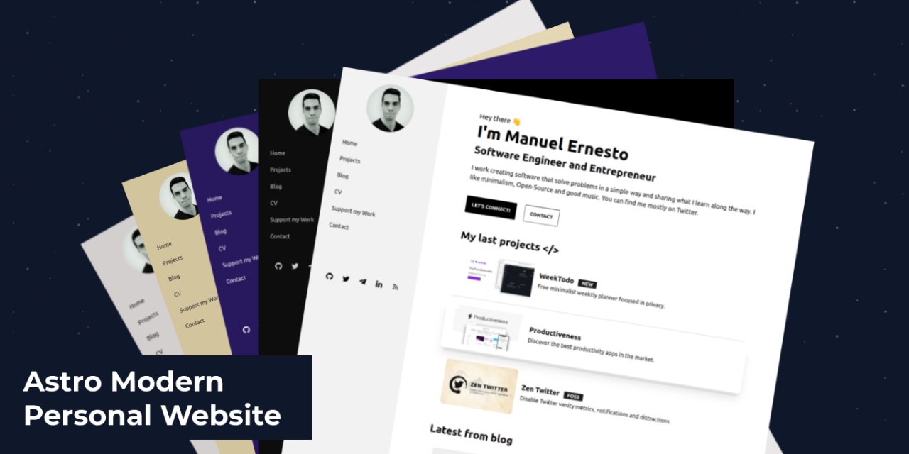

# Portfolio




## 👷‍♂️🏗️ Currently under construction! 🚧👷

Things that need work: GitHub Actions deployment & dependency management

## Installation

Run the following command in your terminal

``` bash
pnpm install
```

Once the packages are installed you are ready to run Astro. Astro comes with a built-in development server that has everything you need for project development. The astro dev command will start the local development server.

``` bash
pnpm dev
```

## Tech Stack

- [Astro](https://astro.build)
- [Tailwind](https://tailwindcss.com/)
- [DaisyUI](https://daisyui.com/)

## Project Structure

``` php
├── src/
│   ├── components/
│   │   ├── cs/
│   │   │   ├── TimeLine
│   │   ├── BaseHead.astro
│   │   ├── Card.astro
│   │   ├── Footer.astro
│   │   ├── Header.astro
│   │   └── HorizontalCard.jsx
│   │   └── SideBar.jsx
│   ├── layouts/
│   │   └── BaseLayout.astro
│   │   └── PostLayout.astro
│   └── pages/
│   │   ├── blog/
│   │   │   ├── [page].astro
│   │   │   ├── post1.md
│   │   │   ├── post2.md
│   │   │   └── post3.md
│   │   └── cv.astro
│   │   └── index.astro
│   │   └── projects.astro
│   │   └── rss.xml.js
│   └── styles/
│       └── global.css
├── public/
│   ├── favicon.svg
│   └── social-image.png
│   └── sprofile.jpg
│   └── social_img.webp
├── astro.config.mjs
├── tailwind.config.cjs
├── package.json
└── tsconfig.json
```

## Deploy

You can deploy the site on your favorite static hosting service such as Vercel, Netlify, GitHub Pages, etc.

The configuration for the deployment varies depending on the platform where you are going to do it. See the [official Astro information](https://docs.astro.build/en/guides/deploy/) to deploy the website.

> **⚠️ CAUTION** </br>
> The Blog pagination of this template is implemented using dynamic route parameters in its filename and for now this format is incompatible with SSR deploy configs, so please use the default static deploy options for your deployments.

## Contributing

Suggestions and pull requests are welcomed! Feel free to open a discussion or an issue for a new feature request or bug.

One of the best ways of contributing is to grab a [bug report or feature suggestion](https://github.com/BrycensRanch/Portfolio/issues) that has been marked `accepted` and dig in.

Please be wary of working on issues *not* marked as `accepted`. Just because someone has created an issue doesn't mean we'll accept a pull request for it.

## License

Astro Modern Personal Website is licensed under the MIT license — see the [LICENSE](https://github.com/BrycensRanch/Portfolio/blob/master/LICENSE) file for details.

## Contributors

<a href="https://github.com/BrycensRanch/Portfolio/graphs/contributors">
  
</a>

Made with [contrib.rocks](https://contrib.rocks).